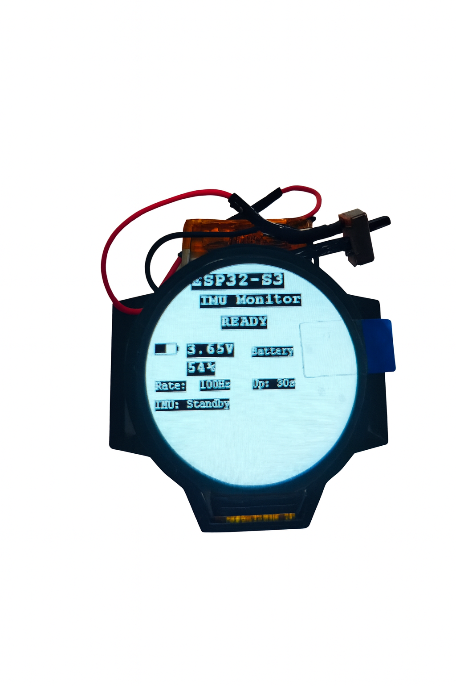
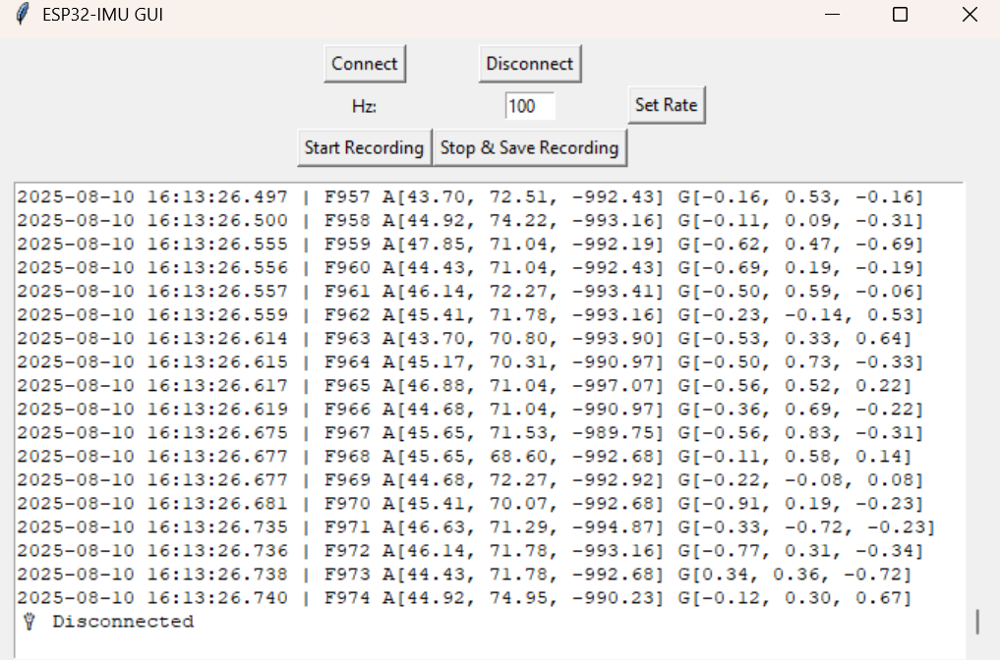

# ESP32‑S3 LCD IMU BLE Logger (with Desktop Client)

A small, end‑to‑end example that turns the **Waveshare ESP32‑S3‑LCD‑1.28** board into a BLE IMU logger and pairs it with a minimal **cross‑platform Python GUI** for live viewing and CSV recording.

- **Firmware:** ESP32‑S3 + QMI8658 (accel/gyro) + 1.28″ 240×240 LCD, BLE GATT server sending JSON frames.
- **Client:** Tkinter + Bleak (Windows/macOS/Linux) to connect, set sampling rate, toggle display backlight, and record to CSV.

<p align="center">
  
  &nbsp;&nbsp;&nbsp;
  
</p>

---

## Repository layout

```
ESP32_LCD/
├─ src/                         # ESP32 firmware sources (Arduino framework)
│  ├─ esp32-s3-lcd-1.28-demo.ino
│  ├─ LCD_1in28.*               # Display driver (240×240)
│  ├─ QMI8658.*                 # IMU driver (acc + gyro), units mg / dps
│  └─ GUI_Paint.*, fonts, etc.
├─ python_client/
│  └─ ble_clientESP32.py        # Tkinter + Bleak desktop client
├─ docs/
│  └─ pics/
│     ├─ device.png             # Board/device photo
│     └─ client.png             # Client screenshot
├─ platformio.ini               # Build configuration (PlatformIO)
└─ README.md                    # This file
```

---

## Hardware

- **Board:** Waveshare **ESP32‑S3‑LCD‑1.28** (1.28″ 240×240 LCD, backlight on GPIO 40)
- **IMU:** **QMI8658** (accelerometer + gyroscope)
- **Battery sensing:** ADC on GPIO 1 (voltage divider as on the Waveshare board)

Pins in firmware (see comments in `esp32-s3-lcd-1.28-demo.ino`):
- `DISPLAY_BL_PIN = 40` (LCD backlight)
- `BATTERY_ADC_PIN = 1`
- Boot button on `GPIO0`

> The PlatformIO `board` is set to `adafruit_qtpy_esp32s3_n4r2` for a convenient S3 config. The pins used are explicit in code and match the Waveshare board.

---

## Build & flash (PlatformIO)

1. Install **VS Code** + **PlatformIO**.
2. Clone this repo and open the project folder.
3. Connect the board in **bootloader mode** if necessary.
4. Build & upload:
   ```bash
   pio run -e esp32-s3-lcd -t upload
   pio device monitor -b 115200
   ```
   The monitor shows heartbeats and command logs.

---

## BLE GATT interface

- **Device name:** `ESP32-IMU`
- **Service UUID:** `12345678-1234-1234-1234-123456789012`
- **Characteristics:**
  - **DATA** (Notify): `abcdef12-3456-789a-bcde-123456789abc`
  - **CONTROL** (Write): `12345678-1234-1234-1234-123456789013`

### Messages on `DATA` (JSON)

1) **IMU frame**
```json
{
  "type": "imu_data",
  "frame": 1234,
  "timestamp": 456789,           // millis() on device
  "accel": [ax_mg, ay_mg, az_mg],  // accelerometer in mg (±range set by driver)
  "gyro":  [gx_dps, gy_dps, gz_dps] // gyroscope in dps
}
```

2) **Battery status**
```json
{
  "type": "battery_status",
  "voltage": 4.07,           // Volts
  "percentage": 86,          // %
  "charging": false,
  "timestamp": 457000
}
```

3) **Warning (e.g., low battery)**
```json
{
  "type": "warning",
  "message": "Low battery: 15%"
}
```

### Commands on `CONTROL` (ASCII)

- `RATE:<Hz>` — set sampling rate (1–500 Hz), e.g. `RATE:100`
- `DISPLAY:ON` / `DISPLAY:OFF` — toggle LCD backlight + screen updates
- `BATTERY:REQUEST` — push a fresh `battery_status`
- `BATTERY_AUTO:ON` / `BATTERY_AUTO:OFF` — enable/disable periodic battery reports

---

## Python desktop client

The client is in `python_client/ble_clientESP32.py`. It:
- Discovers `ESP32-IMU`, connects, and subscribes to `DATA`
- Lets you set the sampling rate
- Toggles display (backlight) with a switch
- Shows live text output
- **Records CSV** with timestamps and raw JSON fields

### Quick start

```bash
# Python 3.10+
python -m venv .venv
source .venv/bin/activate    # Windows: .venv\Scripts\activate
pip install bleak  # Tkinter ships with Python on Win/macOS; on Linux: sudo apt install python3-tk
python python_client/ble_clientESP32.py
```

> On Linux you may need `bluetooth`/`bluez` packages and to run with the right permissions (e.g., add user to the `bluetooth` group).

### CSV schema (as saved by the client)
Columns:
- `pc_timestamp` (ISO, milliseconds)
- `frame` (int)
- `esp_timestamp` (ms since boot)
- `accel` (JSON array as string)
- `gyro` (JSON array as string)

You can post‑process into per‑axis columns if needed.

---

## Display & battery behavior (firmware)

- When **display is ON**, the screen is refreshed at a reduced rate while connected, and backlight is controlled on GPIO 40.
- **Battery**: voltage and percentage are computed on `BATTERY_ADC_PIN` with Waveshare’s divider factor. When `BATTERY_AUTO:ON`, periodic reports are sent; a **low‑battery warning** is broadcast and also drawn on screen.

---

## Extending the project

Ideas that keep the code structure intact:

- **Binary frames (CBOR/MessagePack)** to reduce BLE overhead
- **Time sync** (e.g., client sends host time, device keeps offset)
- **Sequence/CRC** in frames to detect drops
- **SPIFFS/LittleFS logging** as a fallback when BLE is unavailable
- **Config characteristic** exposing ranges (acc/gyro FS, LPF), units (mg vs m/s²), and calibration
- **Multi‑platform UI** (PyQt/Qt for richer plotting; keep the Bleak core)

Contributions are very welcome—see below.

---

## Contributing

1. Open an issue describing the bug/feature.
2. For features, sketch the user‑visible change and any protocol additions.
3. Submit a PR:
   - Keep the JSON schema backward‑compatible when possible
   - Update this README if you change the protocol or client behavior

---

## License

Add a license of your choice (e.g., MIT). If you want, I can drop in an MIT `LICENSE` file.
